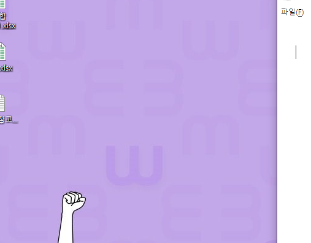

위의 이미지는 절대경로(C드라이브)로 작성되어 있기 때문에, 외부에 공개(github)하면 이미지가 깨져서 보인다.

따라서 다음과 같이 typora 설정을 하자.

- 타이포라 설정을 통해 온라인 열람 가능

  - 파일 -> 환경설정 -> 이미지 -> 3가지 항목 체크 -> copy to image to custom folder -> ./images
  - 로컬 이미지에 위 규칙 적용
  - 온라인 이미지에 위 규칙 적용
  - 가능하다면 상대적 위치 사용		

  

  -  


# 8. 기타 문법

수직선

# ---

**굵게(볼드체)***

# GIT

> Git은 분산비전관리시스템 (DVCS)이다.
>
> 소스코드의 비전 및 이력을 관리할 수 있다.

# 준비하기

윈도우에서 git을 활용하기 위해서 "git.dash" 를 설치한다.

git을 활용하기 위해서 GUI 툴인 source tree, github desktop 등을 활용할 수도 있다.

초기 설치를 완료한 이후에 컴퓨터에 author 정보를 입력한다. 이메일 정보를 github에 가입된 이메일로 일치시켜야 커밋 이력들이 관리된다.

$ git config --global user

# 2. add

working directory 즉 작업 공간에서 변경된 사항을 이력으로 저장하기 위해서는 반드시 staging area 를 거쳐야 한다.

- $ git add markdown.md # 특정 파일
- $ git add images/ # 특정 폴더
- $ git add  # 현재 디텍토리

---

- add 전 상태

  ```
  $ git status
  On branch master
  
  No commits yet
  
  
  
  
  
  Untracked files:
    (use "git add <file>..." to include in what will be committed)
          1.md
          images/
          "\354\240\234\353\252\251 \354\227\206\354\235\214.md"
  
  nothing added to commit but untracked files present (use "git add" to track)
  ```

- add images/ 후 상태

  ```
  $ git add images/
  $ git status
  On branch master
  
  No commits yet
  
  Changes to be committed:
    (use "git rm --cached <file>..." to unstage)
          new file:   "images/\354\272\241\354\262\230.PNG"
  
  Untracked files:
    (use "git add <file>..." to include in what will be committed)
          1.md
          "\354\240\234\353\252\251 \354\227\206\354\235\214.md"
  
  ```

# 3. commit

commit은 이력을 확정짓는 명령어로 해당 사진의 스냅샷을 기록한다.

커밋시에는 반드시 메세지를 작성해야하며 메세지는 변경사항을 알 수 있도록 명확하게 작성한다.

```
$ git commit -m '마크다운 및 git 정리'
```

커밋 해시코드를 바탕으로 구분된다.

# 원격저장소 (remote repository) 활용하기

원격 저장소 기능을 제공하는 다양한 서비스 중에 github 를 기준으로 설명한다.

## 0. 준비사항

- Github에 repository 생성

## 1. 원격 저장소 등록

```
$ git remote add origin 깃허브url
```

- 원격저장소('remote')로 origin 이라는 이름으로 깃허브url 을 등록(add) 한다.

- 등록된 원격 저장소 목록을 보기 위해서는 아래의 명령어를 활용한다.

  ```
  $ git remote -v
  ```

## 2. push - 원격저장소 업로드

```
$ git push origin master
```

origin 으로 설정된 원격저장소에 master 브랜치로 업로드(push)

이후 변경사항이 생길 때마다 add - commit, push 를 반복하시면 된다.

그리고, 항상 모든 명령어 이후에 연관된 상태를 확인하자.

status, log, remote -v

## 3. pull

```
$ git pull oritin master
```

원격 저장소의 변경 사항을 받아온다.

## 4. clone

```
$ git clone 깃허브url
```

원격 저장소를 복제 한다.

- 주의! init 명령어와 같이 기억하자!